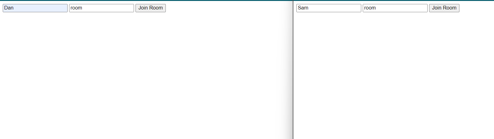
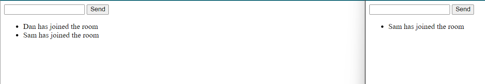
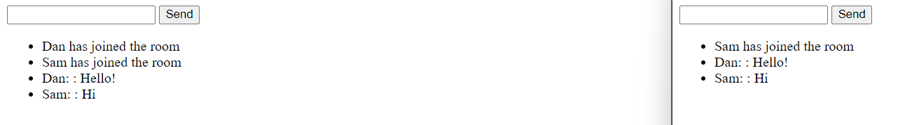
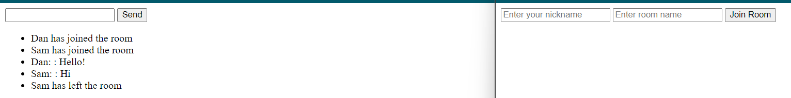

1.

Dan joined room first

2.

Namespaces vs rooms: Rooms are distinctive groups in namespaces. Namespaces allow you to create separate channels for different part of the application. For example namespaces are like rooms in a house, with different purposes like kitchen for admins, and livingroom for general chat. Rooms are like small groups of people in a specific room of the house, for example small groups of people sitting at different tables in the livingroom. People of those rooms can change between rooms, but not go to a different namespace(room of the house) outside of their access, like the kitchen.

3.

- Dockerized the application. Created Dockerfile & .dockerignore files.
- built the docker container: docker build -t chat-app .
- ran the docker container: docker run -p 3000:3000 chat-app
